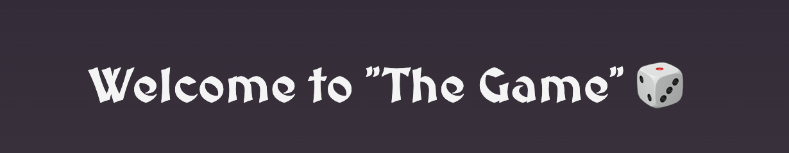
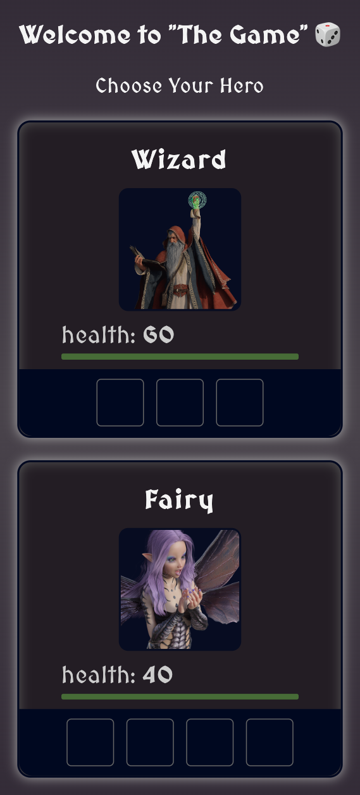
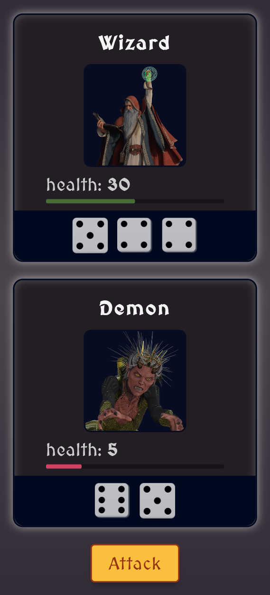

# Choose your hero, roll the dice to attack, and fight against monsters!

 

Initially, I built "The Game" during the Module 7 of [The Frontend Developer Career Path](https://scrimba.com/learn/frontend) on Scrimba. Then I wrote it again alone to practice the learned material and add extra features - you can choose your hero, fight the monsters, and use a button to play again without refreshing the page!

**[Play "The Game"](#) and have fun! It's responsive, so check it out on your phone!** 😉

## What did I learn during the course?

I learned how and why to create `classes` in `JavaScript` and explored the `Object.assign()` method. I got to know the `.map`, `.join`, and `.fill` methods on `arrays` and learned about the `array constructor`, along with the `constructor functions` and `arrow functions`. I also learned about the `ternary operator` and how to improve the UX using the `setTimeout()` and `inset box-shadow`.

## My customizations and what I learned on my own

To make "The Game" fully responsive and nice-looking, I learned how to use CSS variables (`var()`), used a new unit (`vmax`), and created a transition to change the background of the character card when it dies. I also practiced using the `display: flex` property to make sure all the content fits right and got to know the `calc()` and `clamp()` functions to make some magic with elements sizes.

## What it looks like:

| Choosing your hero | In the middle of the game |
| --- | ---|
| |  |